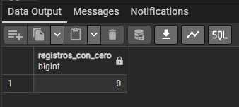
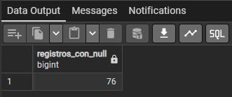
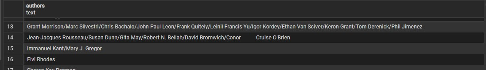

# 📚SISTEMA DE RECOMENDACIÓN DE LECTURA📚
### ¿No sabés qué libro leer? Este sistema quizás te pueda ayudar 🤗​

## ÍNDICE DEL PROYECTO

- [OBJETIVO DEL PROYECTO](#objetivo-del-proyecto)
- [HERRAMIENTAS UTILIZADAS](#herramientas-utilizadas)
- [DESARROLLO](#desarrollo)
	- [1. LIMPIEZA Y EXTRACCIÓN DE DATOS (GOOGLE SHEETS)](#1-limpieza-y-extracción-de-datos-google-sheets)
	- [2. ARQUITECTURA, INGESTA Y GOBERNANZA DE DATOS (PostgreSQL)](#2-arquitectura-ingesta-y-gobernanza-de-datos-postgresql)
 	- [3. VISUALIZACIÓN DE DATOS (POWER BI)](#3-visualización-de-datos-power-bi)  

## OBJETIVO DEL PROYECTO
Optimizar el proceso de selección de lecturas mediante un modelo de priorización basado en datos históricos, calificaciones de usuarios, cantidad de páginas y editoral.

## HERRAMIENTAS UTILIZADAS
Para este proyecto se usó:
1. **Google Sheets** para la Limpieza y Extracción de Datos.
2. **PostgreSQL** para el armado de tablas y creación de consultas.
3. **Power BI** para la visualización y presentación de datos.

## DESARROLLO

### ORIGEN DE LOS DATOS
El dataset utilizado en este proyecto fue obtenido de `Kaggle`: https://www.kaggle.com/datasets/jealousleopard/goodreadsbooks?resource=download

### 1. LIMPIEZA Y EXTRACCIÓN DE DATOS (**GOOGLE SHEETS**).

En esta parte se procesaron los datos crudos. Se pueden consultar los datos en la carpeta [data](./data)

Tras analizar la base de datos, se han identificado diversos errores que afectan la integridad de los datos. El problema principal radica en una desalineación de columnas en ciertos registros, además de fechas con días inexistentes.

1. Se corrigen 4 registros donde el contenido de las celdas se desplazó hacia la derecha (0.035% del total de la muestra).
2. Se corrigen 2 registros que que contienen errores en la columna "publication" ya que las mismas tienen datos de fechas que no existen en el calendario (0.017% del total de la muestra)
3. Una vez corregidos los registros anteriores se analizan los campos restantes en busca de datos nulos, repetidos o vacíos:
- **IDs y ISBNs**: Una vez descartadas las filas malformadas (que generaban falsos duplicados), no se encontraron bookID o isbn13 repetidos.
- **Valores Faltantes**: No se detectaron celdas vacías o con espacios en blanco en las columnas principales (A a L), a excepción de la columna extra creada por el error de alineación.
- **Ratings**: No se encontraron calificaciones mayores a 5 o menores a 0 en los datos correctamente alineados.
- **Páginas**: No se detectaron libros con número de páginas negativo.
4. Se procede a definir los tipo de datos de cada campo:
  - bookID: `TEXT`
  - title	authors: `TEXT`
  - average_rating: `NUMBER`
  - isbn: `TEXT`
  - isbn13: `TEXT`
  - language_code: `TEXT`
  - num_pages: `NUMBER`
  - ratings_count: `NUMBER`
  - text_reviews_count: `NUMBER`
  - publication_date: `DATE` (FORMATO: AAAA-MM-DD)
  - publisher; `TEXT`

  Se guarda el archivo en formato `.csv` para luego trabajarlo en PostgreSQL

  ### 2. ARQUITECTURA, INGESTA Y GOBERNANZA DE DATOS (**PostgreSQL**).

Se realiza el registro del backend de datos para el proyecto. Se detalla el diseño del esquema, los errores críticos de infraestructura detectados durante la ingesta, las auditorías de calidad de datos (QA) y las estrategias transaccionales aplicadas para garantizar la fidelidad de los reportes.

Las queries pueden ser consultadas en la carpeta [sql_queries](./sql_queries)

### ÍNDICE DEL PIPELINE
- [1. Fase 1: Definición del esquema DDL y Refactorización.](#1-fase-1-definición-del-esquema-ddl-y-refactorización)
- [2. Fase 2: Pipeline de ingesta masiva.](#2-fase-2-pipeline-de-ingesta-masiva)
- [3. Fase 3: Auditoría de Calidad y Detección de anomalías.](#3-fase-3-auditoría-de-calidad-y-detección-de-anomalías)
- [4. Fase 4: Transformación transaccional y capa de abstracción.](#4-fase-4-transformación-transaccional-y-capa-de-abstracción)
- [5. Fase 5: Normalización y creación de nuevas tablas.](#5-fase-5-normalización-y-creación-de-nuevas-tablas)
- [6. Fase 6: Creación de consulta para el análisis de datos.](#6-fase-6-creación-de-consultas-para-el-análisis-de-datos)

### 1. Fase 1: Definición del esquema DDL y Refactorización
Se comienza esta fase con la creación del database `books`. Luego, se procede a la creación de la tabla `db_books`, asignando las restricciones correspondientes a cada campo.
Al definir la estructura inicial, se establecieron restricciones estándar como `VARCHAR(255)` y `VARCHAR(30)` para los campos `authors` y `publisher` respectivamente, basados en una primera lectura preliminar

*Error:* Durante las importaciones del dataset, el pipeline colapsó debido al desbordamiento de longitud de caracteres. El dataset contenía listas extensas de coautores y nombres de editoriales complejas que superaban los límites previstos.

*Solución:* Se aplica una reingeniería de esquema mendiante la sentencia `ALTER TABLE`, modificando los campos a tipo `TEXT`. Esto elima el límite arbitrario de caracteres, optimiza la gestión de almacenamiento dinámico de PostgreSQL y blinda el pipeline contra futuras cargas de datos variables.

```sql
-- ==========================================================================================
-- PASO 1: DEFINICIÓN DEL ESQUEMA DE LA BASE DE DATOS
-- DESCRIPCIÓN: CREACION DEL ESQUEMA DE LA BASES DE DATOS Y MODIFICACIONES ESTRUCTURALES.
-- ==========================================================================================

-- 1. CREAR LA DATABASE.
-- CREATE DATABASE books;

-- 2. CREAR LA TABLA CON RESTRICCIONES ESTRICTAS Y DEFINICIÓN DE LA PRIMARY KEY.

CREATE TABLE db_books (
    bookID INT PRIMARY KEY,
    title TEXT NOT NULL,
    authors VARCHAR(255), -- Restricción inicial
    avg_rating DECIMAL(3,2),
    isbn VARCHAR(20),
    isbn13 VARCHAR(20),
    language_code VARCHAR(10),
    num_pages INT,
    rating_counts BIGINT,
    text_review_counts INT,
    publication_date DATE,
    publisher VARCHAR(30)  -- Restricción inicial
);

-- 3. REFACTORIZACIÓN Y OPTIMIZACIÓN DE ESQUEMAS.
-- Al cargar los datos desde el formato .csv, se detecta que los campos 'authors' y 'publisher' excedían los limites de longitud.
-- Se modifica a tipo 'TEXT' para evitar la saturación de la memoria y poder cargar los datos.

ALTER TABLE db_books
ALTER COLUMN authors TYPE TEXT;

ALTER TABLE db_books
ALTER COLUMN publisher TYPE TEXT;
```

### 2. Fase 2: Pipeline de ingesta masiva

Luego del arreglo del error mencionado en la fase 1, se procede a la carga del dataset.

Para la carga del conjunto de datos preprocesado en Google Sheets, se optó por una estrategia de carga masiva integrada (`Bulk Load`) aprovechando la arquitectura local del servidor de base de datos. 

Al encontrarse el archivo `.csv` limpio y el motor PostgreSQL en el mismo entorno de desarrollo local, el uso del comando nativo `COPY` representa la solución óptima y de mayor velocidad de procesamiento, evitando la sobrecarga de transferencias por red o inserciones línea por línea (`INSERT INTO`)

```sql
-- ==========================================================================================
-- PASO 2: PIPELINE DE INGESTA DE DATOS
-- DESCRIPCIÓN: INGESTA MASIVA DEL DATASET DE LIBROS PREPROCESADOS EN FORMATO .csv.
-- ==========================================================================================

-- El archivo origen ha pasado por una fase previa de auditoría y limpieza en 
-- Google Sheets para garantizar que los delimitadores y encodigs no rompan la ingesta.

COPY db_books (
    bookID, 
    title, 
    authors, 
    avg_rating, 
    isbn, 
    isbn13, 
    language_code, 
    num_pages, 
    rating_counts, 
    text_review_counts, 
    publication_date, 
    publisher
)
FROM 'G:/My Drive/Data Analysis/Portfolio/Proyecto 1 - Books/Dataset/books_clean.csv'
WITH (
    FORMAT CSV, 
    HEADER true, 
    DELIMITER ',', 
    ENCODING 'UTF8'
);

```
### 3. Fase 3: Auditoría de Calidad y Detección de anomalías

Se procede a realizar una auditoría de calidad de la base de datos para determinar si la misma presenta errores y para actuar en caso afirmativo. Esto permite garantizar la calidad de los datos importados.

```sql
-- ==========================================================================================
-- PASO 2: GARANTÍA DE CALIDAD DE LOS DATOS (QA) Y CONSULTAS DE AUDITORÍA
-- DESCRIPCIÓN: COMPROBACIONES DE CALIDAD DE LOS DATOS PARA GARANTIZAR LA INTEGRIDAD DE LOS
-- LOS MISMOS 
-- ==========================================================================================

-- 1. Verificación del volumen de ingesta: asegura que el volumen total de filas coincida
-- con el archivo fuente.

SELECT COUNT(*) AS null_rating_counts
FROM db_books
WHERE rating_counts IS NULL;

-- 2. Detección de valores atípicos estructurales: identifica filas potencialmente dañadas
-- (por ejemplo: cantidad de páginas negativas).

SELECT 
	MIN(num_pages) AS min_page_count,
	MAX(num_pages) AS max_page_count,
	AVG(num_pages) AS avg_page_count
FROM db_books;

-- Se determina la cantidad de registros con num_pages = 0 (Un total de 76 registros)
SELECT COUNT(*)
FROM db_books
WHERE num_pages = 0;

-- Se analiza el avg_rating de los registros con 0 páginas para ver si son promedios altos
SELECT bookid,
		title,
		avg_rating,
		num_pages
FROM db_books
WHERE num_pages = 0
ORDER BY avg_rating DESC;

-- Se calcula el promedio de todos los registros con 0 páginas (AVG = 3.925)
SELECT AVG(avg_rating)
FROM db_books
WHERE num_pages = 0;

-- Se define no eliminar los registros ya que implicarían un distorsión del análisis de datos
-- en el paso 04 se implementan las soluciones elegidas.
```
Como detalla la consulta sql, se encontraron un total de 76 registros con el campo `num_pages` igual a 0. Al ser un volumen representativo (0.68% del total de la muestra de datos), eliminar estos registros distorsionaría el análisis de datos posterior, por lo que, se decide implementar otra solución. La misma se explica en la siguiente fase (Fase 4).

### 4. Fase 4: Transformación transaccional y capa de abstracción

Se decide implementar dos tipos de soluciones para gestionar la anomalía en el campo `num_pages` (libros con 0 páginas).

La primera de ellas consiste en realizar una transformación de datos

```sql
-- ==========================================================================================
-- PASO 4: TRANSFORMACIÓN DE DATOS E IMPLEMENTACIÓN DE ESTRATEGIA.
-- DESCRIPCIÓN: IMPLEMENTACIÓN DE ESTRATEGIA DE REDUNDANCIA PARA LA GESTIÓN DE ANOMALÍAS 
-- (LIBROS CON 0 PÁGINAS). SE APLICAN DOS SOLUCIONES EN PARALELO.
-- ==========================================================================================

-- ESTRATEGIA 1: MUTACIÓN DE LA TABLA (Para análisis de datos en SQL)
-- Cambiar '0' por 'NULL' asegura que funciones como AVG() ó MEDIAN() no se vean sesgadas en 
-- la tabla base, manteniendo el registro para análisis de otras variables.

BEGIN TRANSACTION;

UPDATE db_books
SET num_pages = NULL
WHERE num_pages = 0;

--Verificaciónes

SELECT COUNT(*) AS registros_con_cero
FROM db_books
WHERE num_pages = 0;

SELECT COUNT(*) AS registros_con_null
FROM db_books
WHERE num_pages IS NULL;

COMMIT;
```
Se realiza una verificación final de la solución implementada para asegurarse que los datos coinciden. Ambas queries devuelven los resultados esperados:





La segunda solución consiste en la creación de una `vista` que aisla por completo los registros sin datos (`null`). Esto permite tomar esta base de datos para poder realizar reportes limpios.

```sql
CREATE VIEW vista_db_books AS 
SELECT
	bookID,
    title,
    authors,
    avg_rating,
    isbn,
    isbn13,
    language_code,
    num_pages,
    rating_counts,
    text_review_counts,
    publication_date,
    publisher
FROM db_books
WHERE num_pages IS NOT NULL; -- Toma la transformación realizada en la Estrategia 1
```
Nota: Ambas soluciones permiten realizar análisis de datos mas confiables.

### 5. Fase 5: Normalización y creación de nuevas tablas.

Este paso detalla la normalización de la base de datos, debido a que se detecta en el campo `authors` de la base de datos `db_books`, una gran cantidad de autores por cada registro almacena, lo que ensucia y dificulta la creación de consultas.

```sql
SELECT DISTINCT(authors)
FROM db_books;
```


**Solución:**
- 1. Se decide tomar el primer autor para cada uno de los registros de la base de datos. Por lo tanto, eliminar los datos que siguen después de `/`.
- 2. Se procede a la creación de las tablas `books`,`authors`,`publishers`,`languages`. Esto nos va a permitir reducir la redundancia en las consultas y mejorar la integridad del sistema.

```sql
-- ====================================================================================
-- FASE 5: NORMALIZACIÓN Y CREACIÓN DE NUEVAS TABLAS
-- Descripción: Se normaliza la base de datos para reducir la redundancia y mejorar la 
-- integridad. 
-- En lugar de una sola tabla db_books, se necesita separar la información en tablas
-- independientes:
-- Libros (Books), Autores (authors), Editoriales (publishers), Idiomas (languages)
-- ====================================================================================

-- DISEÑO DEL NUEVO ESQUEMA SQL

-- 1. Tabla de Idiomas

CREATE TABLE languages (
	language_id SERIAL PRIMARY KEY,
	language_code VARCHAR(10) UNIQUE NOT NULL
);

-- 2. Tabla de Editoriales

CREATE TABLE publishers (
	publisher_id SERIAL PRIMARY KEY,
	publisher_name VARCHAR(255) UNIQUE NOT NULL
);

-- 3. Tabla de Autores

CREATE TABLE authors (
	author_id SERIAL PRIMARY KEY,
	author_name VARCHAR(255) UNIQUE NOT NULL
);

-- 4. Tabla de Libros (sin la columna 'authors' ni el nombre de la editorial)
CREATE TABLE books (
    bookID INT PRIMARY KEY,
    title TEXT NOT NULL,
    avg_rating DECIMAL(3,2),
    isbn VARCHAR(20),
    isbn13 VARCHAR(20),
    num_pages INT,
    rating_counts BIGINT,
    text_review_counts INT,
    publication_date DATE,
    publisher_id INT REFERENCES publishers(publisher_id),
    language_id INT REFERENCES languages(language_id)
);

-- 5. Tabla Intermedia: Relaciona Libros con Autores

CREATE TABLE book_authors (
	book_id INT REFERENCES books(bookID),
	author_id INT REFERENCES authors(author_id),
	PRIMARY KEY (book_id, author_id)
);


-- PROCESO ETL (Extract, Transform, Load): Repartición de datos de bd_books
-- a las nuevas tablas normalizadas.

-- Insertar idiomas únicos

INSERT INTO languages (language_code)
SELECT DISTINCT language_code
FROM db_books;

-- Control y verificación
SELECT *
FROM languages;

-- Insertar editoriales únicas

INSERT INTO publishers (publisher_name)
SELECT DISTINCT publisher
FROM db_books;

-- Control y verificación
SELECT * 
FROM publishers;

-- CONSULTA DE LOS AUTORES POR LIBRO
SELECT DISTINCT authors
FROM db_books;
-- AL HABER REGISTROS CON GRAN CANTIDAD DE AUTORES, SE DECIDE SÓLO TOMAR EL PRIMERO
-- DE CADA REGISTRO.

-- SE INSERTA EN LA TABLA 'books' una columna para el autor
ALTER TABLE books
ADD COLUMN author_id INT REFERENCES authors(author_id);

-- EXTRAIGO SOLO EL TEXTO QUE ESTA ANTES DE LA PRIMER '/' DE LA TABLA 'authors' 
-- INSERTO LOS DATOS EN LA TABLA

INSERT INTO authors (author_name)
SELECT DISTINCT TRIM(SPLIT_PART(authors,'/',1))
FROM db_books;

-- Control y verificación
SELECT *
FROM authors;


-- INSERTO LOS DATOS A LA TABLA 'books' (Tabla Normalizada para realizar consultas)
INSERT INTO books (
    bookID, title, avg_rating, isbn, isbn13, 
    num_pages, rating_counts, text_review_counts, 
    publication_date, publisher_id, language_id, author_id
)
SELECT 
    b.bookID, b.title, b.avg_rating, b.isbn, b.isbn13, 
    b.num_pages, b.rating_counts, b.text_review_counts, 
    b.publication_date, 
    p.publisher_id, 
    l.language_id,
    a.author_id
FROM db_books b
JOIN publishers p ON b.publisher = p.publisher_name
JOIN languages l ON b.language_code = l.language_code
JOIN authors a ON a.author_name = TRIM(SPLIT_PART(b.authors, '/', 1));
```
Nota: Se trabajará con las tablas anteriormente creadas.

### 6. Fase 6: Creación de consultas para el análisis de datos.

Una vez normalizadas las bases de datos y con la creación de nuevas tablas, podemos comenzar a generar las `queries` que nos permitan dar respuesta a las siguientes preguntas:

- 1. ¿Cuáles son los 10 libros con mejor puntuación de toda la plataforma, mostrando el nombre del autor, editorial, puntuación, cantidad de páginas y cantidad de puntuaciones?

Propósito: Darle al usuario lo mejor de lo mejor de forma directa.

```sql
-- ==========================================================================================
-- FASE 6: CONSULTAS PARA EL ANÁLISIS DE DATOS
-- DESCRIPCIÓN: SE PRESENTAN LAS CONSULTAS QUE NOS PERMITEN REALIZAR UNA ANÁLISIS DE DATOS
-- RESPECTO A LA BASE DE DATOS.
-- ==========================================================================================

-- 1. ¿Cuáles son los 10 libros con mejor puntuación de toda la plataforma,
-- mostrando el nombre del autor, editorial, puntuación, cantidad de páginas y cantidad de puntuaciones?

SELECT b.title AS titulo,
		a.author_name AS autor,
		p.publisher_name AS editorial,
		b.avg_rating AS puntuacion,
		b.rating_counts AS cantidad_de_puntuaciones
FROM books b
INNER JOIN authors a -- Unimos a la tabla authors
ON b.author_id = a.author_id
INNER JOIN publishers p -- Unimos a la tabla publishers
ON b.publisher_id = p.publisher_id
ORDER BY avg_rating DESC, b.rating_counts DESC -- Se orden por puntuación y por cantidad de puntuaciones
LIMIT 10; -- Se toman los 5 primeros registros

-- El resultado devuelto es erróneo porque no se esta teniendo en cuenta la relación
-- entre los campos 'avg_rating' y 'rating_counts'
-- (No se puede tomar un libro con una puntuación de 5 si sólo recibió una puntuación o reseña)
-- Se debe adoptar un criterio de análisis para definir a partir de qué cantidad de puntuaciones realizadas
-- esta bien considerar la clasificación de un libro
```
El resultado de la consulta anterior es el siguiente:


Si analizamos el resultado obtenido, podemos ver que todos los registros de libros devueltos tienen una puntuación de 5 puntos, pero la cantidad de puntuaciones recibidas son bajas. Es por esto que el resultado obtenido no es confiable, ni certero (no se puede tomar un libro como bueno si sólo ha recibido un total de 5 puntuaciones).
Para poder trabajar con un valor confiable se procede a implementar cálculos estadísticos y funciones de agregación ordenada.

```sql
-- =================================================================================
-- QUERIES PARA CÁLCULOS ESTADÍSTICOS (FUNCIONES DE AGREGACIÓN ORDENADA)
-- =================================================================================

-- QUERY 1: CÁLCULO DEL MIN, MAX Y AVG DE rating_counts 

SELECT 
	-- 1. Mínima puntuación
		MIN(avg_rating) AS min_puntuacion,
	-- 2. Máxima puntuación
		MAX(avg_rating) AS max_puntuacion,
FROM books;

-- Comprobamos que no hay valores menores a 0 y mayores a 5

-- QUERY 2: CÁLCULO DEL PROMEDIO, MEDIANA Y PERCENTIL 75.

SELECT 
    -- 1. El Promedio (Sensible a valores extremos)
    ROUND(AVG(rating_counts), 2) AS promedio_votos,
    
    -- 2. La Mediana (El valor real del centro: 50% de los libros tienen más que esto, 50% tienen menos)
    PERCENTILE_CONT(0.50) WITHIN GROUP (ORDER BY rating_counts) AS mediana_votos,
    
    -- 3. Percentil 75 (El top 25% de los libros con más votos)
    PERCENTILE_CONT(0.75) WITHIN GROUP (ORDER BY rating_counts) AS percentil_75_votos
FROM books
WHERE rating_counts > 0; -- Excluimos los que no tienen votos para no desvirtuar

-- Para poder analizar la puntuación de los libros de manera mas eficaz podemos trabajar con la MEDIANA (766) ó con
-- el PERCENTIL 75 (5061.5).
-- Se decide trabajar con el Percentil 75.
```
Ahora con un dato más confiable podemos dar respuesta a la pregunta 1.

```sql
-- 1. ¿Cuáles son los 10 libros con mejor puntuación de toda la plataforma,
-- mostrando el nombre del autor, editorial, puntuación, cantidad de páginas y cantidad de puntuaciones?
SELECT b.title AS titulo,
		a.author_name AS autor,
		p.publisher_name AS editorial,
		b.avg_rating AS puntuacion,
		b.num_pages AS cant_de_paginas,
		b.rating_counts AS cant_de_puntuaciones
FROM books b
INNER JOIN authors a  -- Unimos a la tabla authors para traer el nombre del autor
ON b.author_id = a.author_id 
INNER JOIN publishers p -- Unimos a la tabla publisher para traer el nombre de la editorial
ON b.publisher_id = p.publisher_id
WHERE b.rating_counts >= 5061 --Tomamos el percentil 75 
ORDER BY b.avg_rating DESC
LIMIT 10;
```


- 2. ¿Quiénes son los 10 autores con mejor promedio de calificación (considerando solo su libro más exitoso)?

Propósito: Evitar que un solo autor famoso (como J.K. Rowling) acapare todas las recomendaciones.

```sql
SELECT a.author_name AS autor,
		ROUND(AVG(b.avg_rating),2) AS promedio_puntuacion,
		COUNT(b.bookid) AS cantidad_de_libros_top
FROM books b
INNER JOIN authors a
ON b.author_id = a.author_id
WHERE rating_counts >= 5061 --Tomamos el percentil 75
GROUP BY a.author_name
HAVING COUNT(b.bookid) >=2 -- Filtramos autores que tengan al menos 2 libros en este nivel
ORDER BY promedio_puntuacion DESC, SUM(b.rating_counts) DESC
LIMIT 10;
```


Al analizar los resultados, vemos que las puntuaciones son extremadamente altas (4.7-4.8). Esto se debe al uso del percentil 75 como condición, por lo que estamos tomando solamente aquellos libros "populares".
Si queremos obtener libros que tengan una buena puntuación pero sean pocos conocidos, formulamos otra consulta:

- 3. ¿Qué libros tienen una puntuación excelente (mayor a 4.3) pero son poco conocidos (tienen entre 500 y 2,000 votos)?

Propósito: Encontrar libros de nicho que son amados por quienes los leen, pero que no son tan comerciales.

```sql
SELECT a.author_name AS autor,
		ROUND(AVG(b.avg_rating),2) AS promedio_puntuacion,
		COUNT(b.bookid) AS cantidad_de_libros_top
FROM books b
INNER JOIN authors a
ON b.author_id = a.author_id
WHERE avg_rating >= 4.3 AND rating_counts BETWEEN 500 AND 2000 --Condición de filtrado 
GROUP BY a.author_name
HAVING COUNT(b.bookid) >=2 -- Filtramos autores que tengan al menos 2 libros en este nivel
ORDER BY promedio_puntuacion DESC, SUM(b.rating_counts) DESC
LIMIT 10;
```


- 4.¿Qué editoriales han publicado la mayor cantidad de libros con una calificación superior a 4.0?

Propósito: Ayudar al usuario a identificar qué editoriales suelen tener un estándar de calidad más alto.

```sql
SELECT p.publisher_name AS editorial,
		COUNT(bookid) AS total_libros_top, --Cuenta cuántas filas (libros) se agruparon por editorial
		ROUND(AVG(b.avg_rating),2) AS nota_promedio_editorial --Calcula el promedio de notas del grupo y lo redondea a 2 decimales
FROM books b
INNER JOIN publishers p
	ON b.publisher_id = p.publisher_id
WHERE b.avg_rating >= 4 --Solo entran al cálculo los libros que ya son buenos (+4 estrellas)
GROUP BY p.publisher_name
HAVING COUNT(bookid) >= 10 --Descarta las editoriales que tienen menos de 10 libros en el grupo
ORDER BY nota_promedio_editorial DESC
LIMIT 10;
```


La siguiente consulta le permite al usuario filtrar por una editorial específica
```sql
SELECT b.title AS titulo,
		b.avg_rating AS puntuacion,
		a.author_name AS autor,
		p.publisher_name AS editorial
FROM books b
INNER JOIN publishers p
		ON b.publisher_id = p.publisher_id
INNER JOIN authors a
		ON b.author_id = a.author_id
WHERE p.publisher_name = 'Andrews McMeel Publishing' AND avg_rating >= 4;
```

### 3. VISUALIZACIÓN DE DATOS (**POWER BI**)

El proyecto continua con el uso de Power BI para lograr crear un Tablero que le permita al usuario obtener la información más relevante de la base de datos.

Lo primero en realizar es la conexión a la `Base de datos PostgreSQL`. Realizamos la correspondiente conexión a la misma e importamos la base de datos. 
Luego se eligen las columnas `books`,`authors`, `languages` y `publishers`. Se accede a `Power Query` para la transformación de datos, en caso de ser necesario. 
Las campos que se modificaron son: `bookid`, `author_id`, `language_id` y `publisher_id`. Los mismos tenia tipo de dato `numeric` y se lo cambia a `text`.

Ahora con las tablas transformadas, creamos las relaciones entre las mismas.


Se muestra el siguiente ejemplo de la relación entre las tablas ´books´ y ´authors´.


### Medidas del Proyecto.

#### 1. Total de Autores.
El propósito de `Total_Autores` es mostrar cuántos escritores diferentes existen en la base de datos actual, asegurándose de que el número sea fácil de leer (con separadores de miles) y que no cuente dos veces al mismo autor si tiene varios libros.

```sql
Total_Autores =
--Toma el número resultante del conteo y lo convierte en una cadena de texto con un formato específico
FORMAT(
	--Recorre la columna author_id y cuenta cuántos valores únicos encuentra  						
    DISTINCTCOUNT('books'[author_id]),
	-- Formato específico con separador de miles
    "#,##0" 
)
```
#### 2. Total de Editoriales.
El propósito de `Total_Editoriales` es cuantificar cuántas editoriales diferentes han publicado los libros en la base de datos.

```sql
Total_Editoriales = 
--Toma el número resultante del conteo y lo convierte en una cadena de texto con un formato específico
FORMAT(
	--Recorre la columna publisher_id y cuenta cuántos valores únicos encuentra				
    DISTINCTCOUNT('books'[publisher_id]),
	-- Formato específico con separador de miles
    "#,##0"
)
```
#### 3. Total de Idiomas.
El propósito de `Total_Idiomas` es contar cuántos idiomas únicos existen en las base de datos.

```sql
Total_Idiomas = 
DISTINCTCOUNT(books[language_id])
```

#### 4. Total de Libros.
El propósito de `Total_Libros` es mostrar la cantidad total de títulos disponibles en la base de datos.

```sql
Total_Libros = 
FORMAT(
    COUNTROWS('books'), 
    "#,##0"
)
```
**Nota**: Se crea una tabla/carpeta para almacenar las medidas creadas

#### DASHBOARD EXPLORADOR DE LIBROS.


El usuario puede interactuar con el dashboard para buscar su próxima lectura.
El dashboard esta compuesto de:
- 4 tarjetas: Libros, Autores, Editoriales e Idiomas. Las mismas muestran cantidades.
- 6 segmentadores de datos: Título, Autores, Idiomas, Editoriales, Año y Puntaje. El usuario podrá ir modificando estas según lo que esta buscando.
- 2 gráficos: uno de columnas agrupadas y otro de dispersión. El primero muestra el top 5 de los mejores libros, cuyo filtro principal es `rating_counts`>5061 (Percentil 75). El segundo muestra la relación de Popularidad vs Calidad, el mismo tiene dos limitaciones:
  1. Se toman las puntuaciones menores a 1 millón para eliminar aquellos libros populares
  2. Se toma una puntuación entre 3 y 5 puntos.
- Una tabla con la información completa por título, autor, editorial, puntaje, páginas y puntuaciones. Esto le permite al usuario obtener información completa de cada uno de los libros que contiene la base de datos.
